# DAQ Board — General-Purpose Data Acquisition Board

A 2-layer, USB-C powered **data acquisition board** built around an STM32F103,
designed from scratch in Altium, manufactured at JLCPCB, and brought up with
bare-metal firmware. It measures real-world analog signals (16-bit ADC),
generates analog output (12-bit DAC), reads temperature to ±0.1 °C, stores data
to SPI flash, and streams everything to a live browser dashboard over USB.

> Portfolio project #2 of 3 (FPGA → **PCB** → Embedded). Focus: the full
> hardware flow — schematic → layout → fabrication → bring-up → firmware.

---

## What it demonstrates

- **Mixed-signal PCB design** in Altium: analog (ADC/DAC/LDO) + digital (MCU/flash)
- **Multiple buses**: I²C, SPI, UART, USB
- **Full manufacturing flow**: DRC → Gerbers → JLCPCB assembly → DFM
- **A pin-by-pin schematic audit before paying** that caught a real error (R5)
- **Bare-metal firmware** (no HAL): direct register access, custom linker script
  and startup, driver code for every peripheral
- **A live web instrument**: Node serial bridge + WebSocket + custom canvas UI

---

## 1 · Design (Altium Designer)

The schematic — mixed-signal, six functional blocks (power, MCU, USB, I²C, SPI
flash, LEDs/SWD):

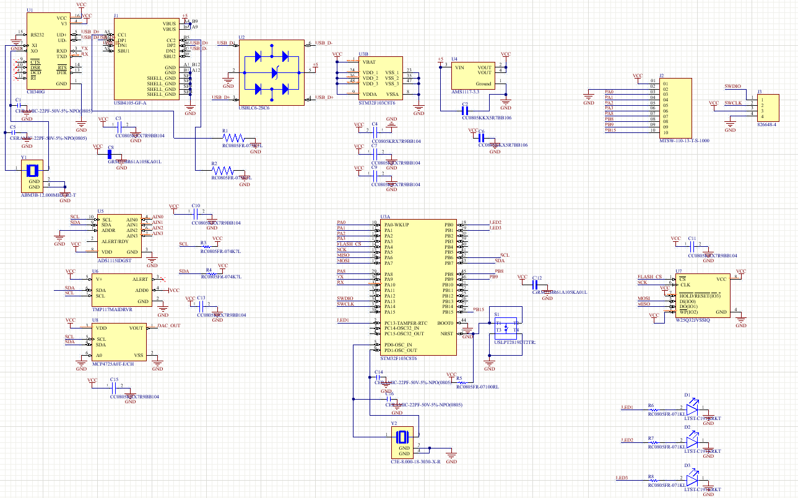

Board layout (2 layers, 59.94 × 40.01 mm) and 3D render:

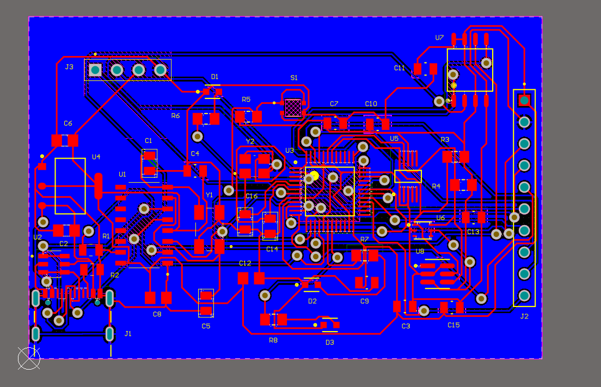
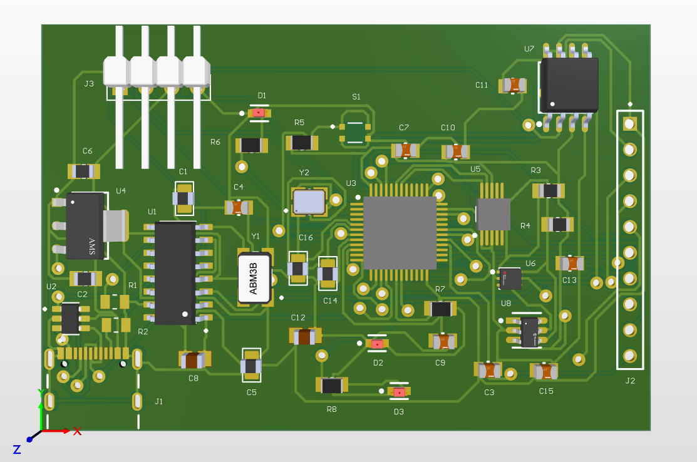

Design Rule Check clean. Worth noting: the Situs auto-router reported
"135/135 100%", but DRC then revealed **23 shorts + 30 clearance violations** →
Unroute All + hand-routing to the clean result below:

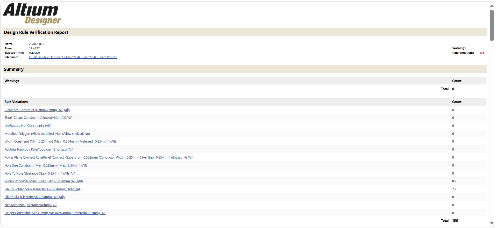

### The schematic audit (the interesting part)

Before paying for assembly, the whole schematic was audited **pin by pin against
datasheets**, block by block. Result: a healthy design with **one real error**.

- **Power (AMS1117):** VIN/VOUT/GND correct, tab tied to VOUT (the classic 1117
  trap — here done right), 10 µF in/out.
- **STM32:** all VDD/VDDA→VCC, VSS→GND, BOOT0→GND, clock OK.
  **🔴 R5 was 100 Ω → should be 10 kΩ (NRST pull-up). Caught and corrected.**
- **USB:** UART cross correct (CH340 RXD→TX), CH340 at 3.3 V, USBLC6 with no
  D+/D− short, R1/R2 = 5.1 kΩ.
- **I²C:** addresses verified collision-free → `0x48` / `0x49` / `0x60`
  (MCP4725 is the **A0** variant → `0x60`, *not* `0x62`). Pull-ups 4.7 kΩ.
- **SPI flash:** `/HOLD` and `/WP` tied to VCC (critical for the W25Q32).

---

## 2 · Manufacturing (JLCPCB)

DFM placement review before assembly — top and bottom:

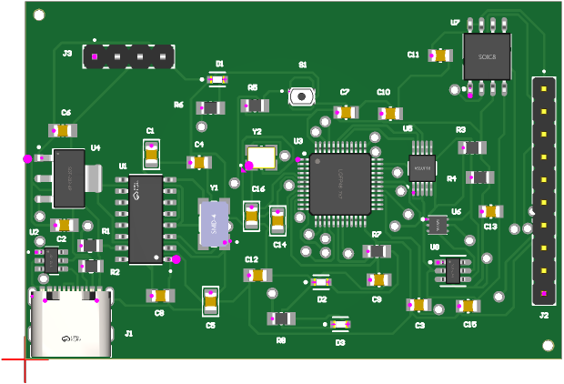
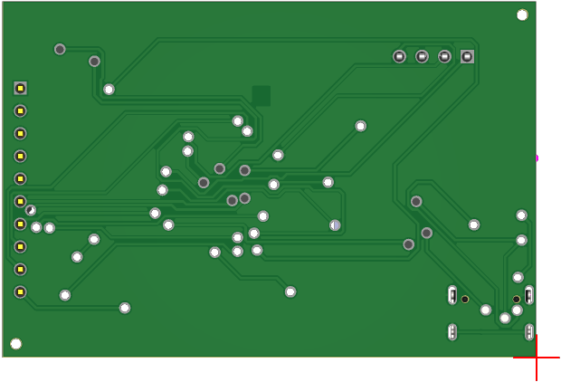

Five assembled boards, straight from the fab:

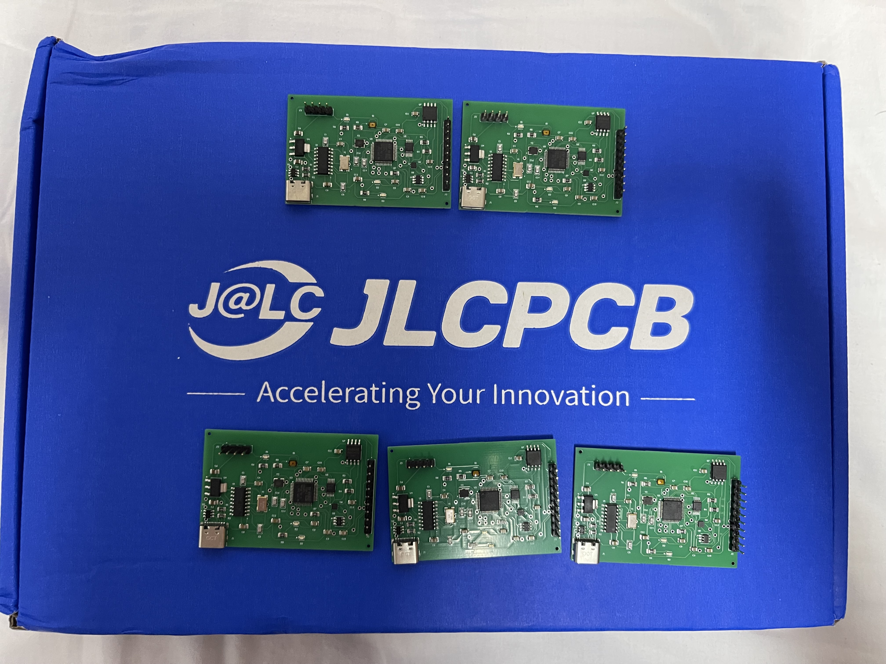

---

## 3 · The board


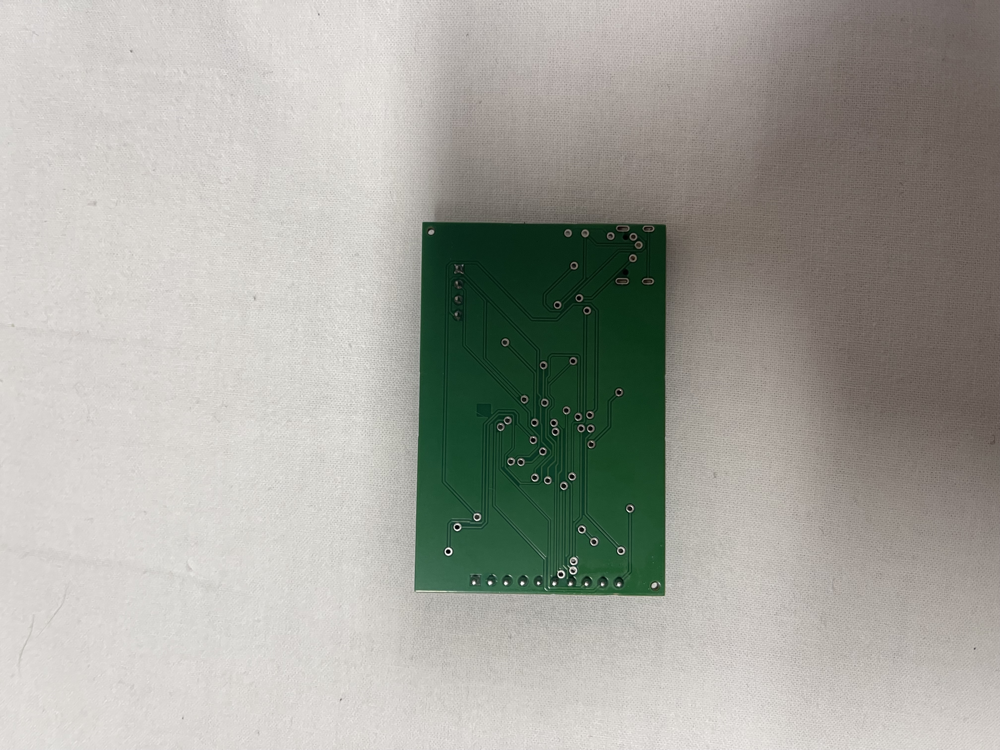

| Component | Ref | Function | Bus / Address |
|---|---|---|---|
| STM32F103C8T6 | U3 | MCU (Cortex-M3, 72 MHz) | — |
| ADS1115 | U5 | 16-bit ADC, 4 channels | I²C `0x48` |
| TMP117 | U6 | Precision temp sensor (±0.1 °C) | I²C `0x49` |
| MCP4725 | U8 | 12-bit DAC | I²C `0x60` |
| W25Q32 | U7 | 4 MB SPI flash | SPI |
| CH340G | U1 | USB↔UART bridge (3.3 V) | — |
| USBLC6-2SC6 | U2 | USB ESD protection | — |
| AMS1117-3.3 | U4 | 3.3 V LDO | — |

Board: 2-layer FR-4, 1.6 mm, HASL. Assembled by JLCPCB.

---

## 4 · Bring-up

First firmware — a blinking LED validates the MCU, clock and SWD programming
path (ST-Link V2 + OpenOCD):

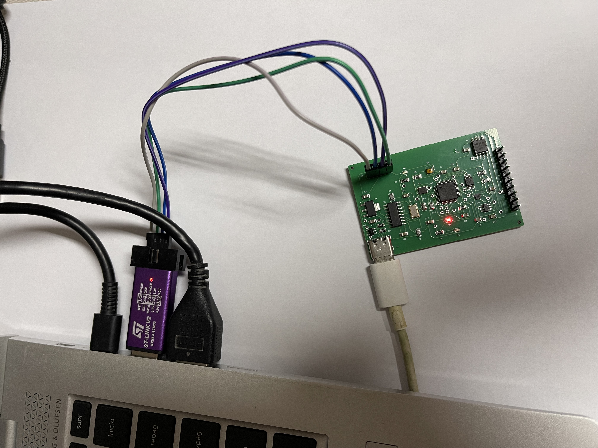

Then each peripheral, one at a time. TMP117 temperature over I²C:

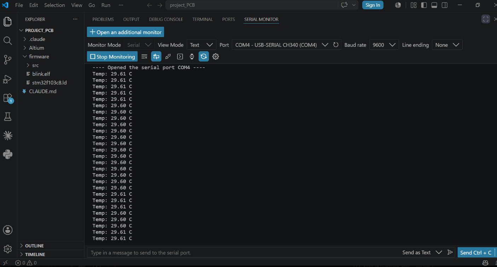

ADS1115 ADC reading alongside the sensor:

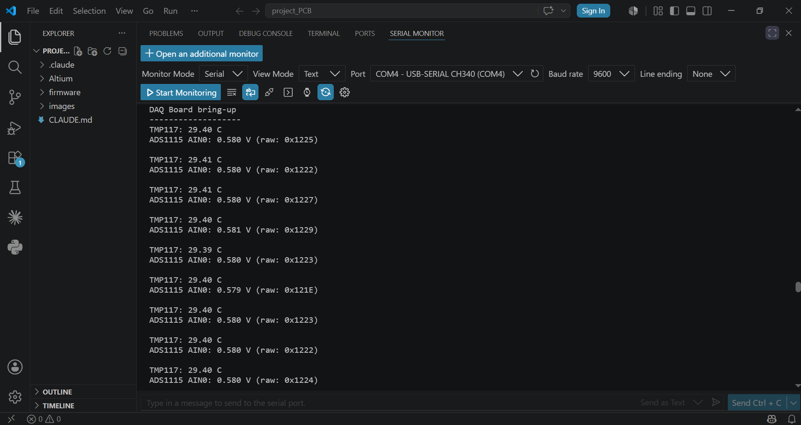

MCP4725 DAC output set to 1.65 V and measured with a multimeter (1.64 V — within
tolerance):

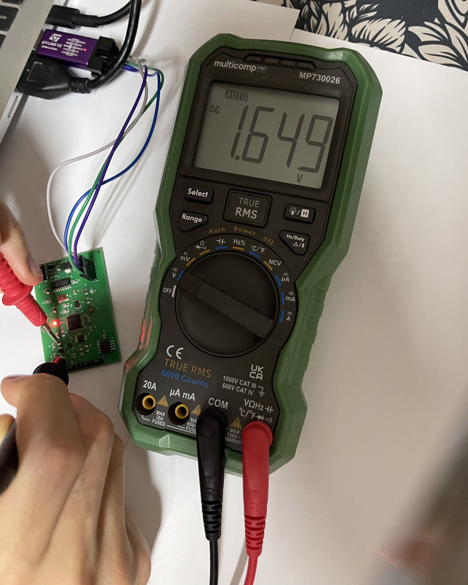

Full bring-up complete — DAC, flash (JEDEC `EF 40 16`, write/read PASS), and
live sensor data all validated:

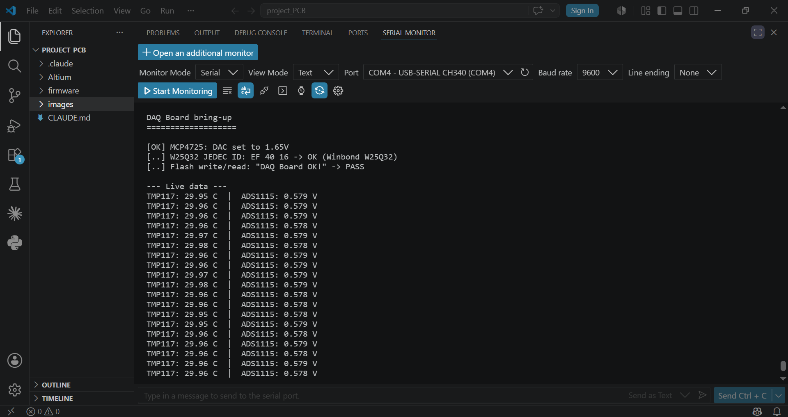

| Step | Result |
|---|---|
| Power (3.3 V rail) | ✅ measured |
| USB / CH340 enumerates | ✅ COM port |
| STM32 detected over SWD | ✅ Cortex-M3 |
| Blink LED (PB0) | ✅ MCU + crystal |
| TMP117 temperature (I²C) | ✅ ~29.6 °C stable |
| ADS1115 ADC read (I²C) | ✅ responds to PGA change |
| MCP4725 DAC output (I²C) | ✅ 1.64 V vs 1.65 V set |
| W25Q32 flash (SPI) | ✅ JEDEC `EF 40 16`, write/read PASS |

---

## 5 · Live dashboard

A Node.js bridge reads the USB serial stream and pushes it to the browser over
WebSocket; the front-end renders a test-&-measurement style instrument
(4-channel scope view, live temperature, DAC control, min/max/avg stats, CSV export).

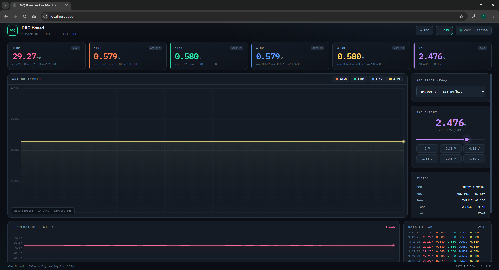

```bash
cd dashboard
npm install
npm start            # auto-detects the CH340 port → http://localhost:3000
```

---

## Function generator (DDS)

The board doesn't just measure — it also **generates** waveforms. A hardware
timer (TIM2) ticks at a fixed sample rate; on each tick a 32-bit phase
accumulator advances and its top bits index a wavetable, whose value is written
to the DAC. This is **Direct Digital Synthesis**, the same method used in real
signal generators. Sine, square, triangle and sawtooth are selectable from the
dashboard, with adjustable frequency.

Getting reliable control while generating required moving UART reception to an
**interrupt** (`USART1_IRQHandler`): each incoming command byte is captured the
instant it arrives, so nothing is lost while the CPU is busy driving the DAC.

**Verification without an oscilloscope.** With no scope on hand, the waveforms
were validated by measuring the DAC output with a multimeter and comparing
against signal theory — the DC average is identical for all shapes (they're
centred at mid-scale), while the AC (RMS) value differs by waveform:

| Waveform | Measured AC (RMS) | Theory (A/√k) |
|---|---|---|
| DC average (all) | 1.65 V | 1.65 V (mid-scale) |
| Sine | 1.16 V | A/√2 = **1.17 V** |
| Square | ~1.6 V | A ≈ **1.65 V** |

The measured sine RMS matching A/√2 almost exactly confirms the shapes are
genuinely different, not just a changing DC level.

---

## Datalogger (on-board flash)

The board can record standalone: samples are written straight to the **W25Q32
SPI flash**, then dumped back over USB on demand. Records are 16 bytes
(index + temperature + four ADC channels), buffered a 256-byte page at a time
and written sequentially, with 4 KB sectors erased on demand as the log grows.

From the dashboard: **Record → Stop → Download** streams the stored records
back off the flash and saves them as a CSV. It's the difference between "we can
talk to the flash" (bring-up) and "the flash does a job" — the chip finally
earns its place on the board.

---

## High-speed capture (timer + DMA, software scope)

The I²C ADS1115 tops out around 860 SPS, so for fast sampling the firmware uses
the **STM32's own 12-bit ADC** on **PA0** (which *is* broken out, on the J2
header). A hardware timer (TIM3) triggers each conversion and **DMA** streams the
results straight into RAM — the CPU is idle during the capture, so the rate is
set purely by the timer (tested to tens of kSPS). A block of 480 samples is then
sent to the dashboard and drawn as a waveform: a **software oscilloscope**.

This is the "demo → serious firmware" jump: hardware-timed acquisition, DMA, and
interrupt-driven UART working together. It also gives the board a genuinely
**accessible analog input** (J2·PA0) — unlike the ADS1115's AIN pins, which this
revision does not break out. Validated with a real **LDR light sensor** wired to
J2·PA0: covering the sensor moves the captured level up and down live — a real,
physically-controllable analog input, which is exactly what the precision ADC's
inputs could not be without a board respin.

---

## System integration: PCB → FPGA → PC

The capstone. This board feeds a real-time DSP chain running on an FPGA — tying
together the three projects in my portfolio (PCB · FPGA · embedded) into one
working signal path. The STM32 generates a signal, a **Zynq FPGA filters it in
real time** with a FIR filter, and the result is plotted on the PC.

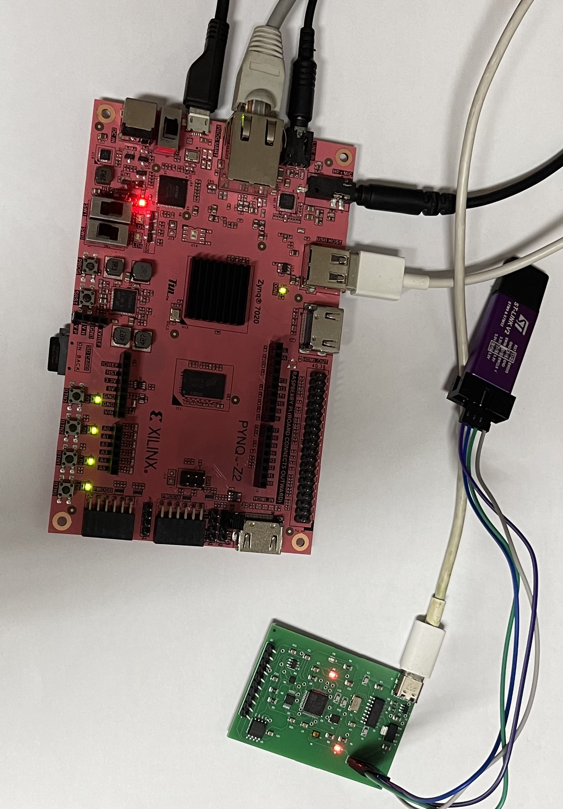

**How it works.** The board streams samples over its USB serial link into a
**PYNQ-Z2**. There, a Python script reads the samples and pushes them through a
FIR filter implemented in the FPGA fabric over **AXI4-Lite**, then reads the
filtered result back:

```
STM32 (signal)  →  USB  →  PYNQ PS (Python)  →  AXI-Lite  →  FIR in FPGA fabric
                                    ↑─────────── filtered sample ──────────┘
```

The FIR ([separate project](https://github.com/alex-morral/fir-filter-zynq),
originally fed by an I²S audio codec) needed a small RTL change to accept samples
from the processing system: a new AXI **Din** register that writes a sample into
the filter and pulses its `enable`, plus a source mux (I²S *or* AXI). The
processor-side data path is then pure Python on the PYNQ:

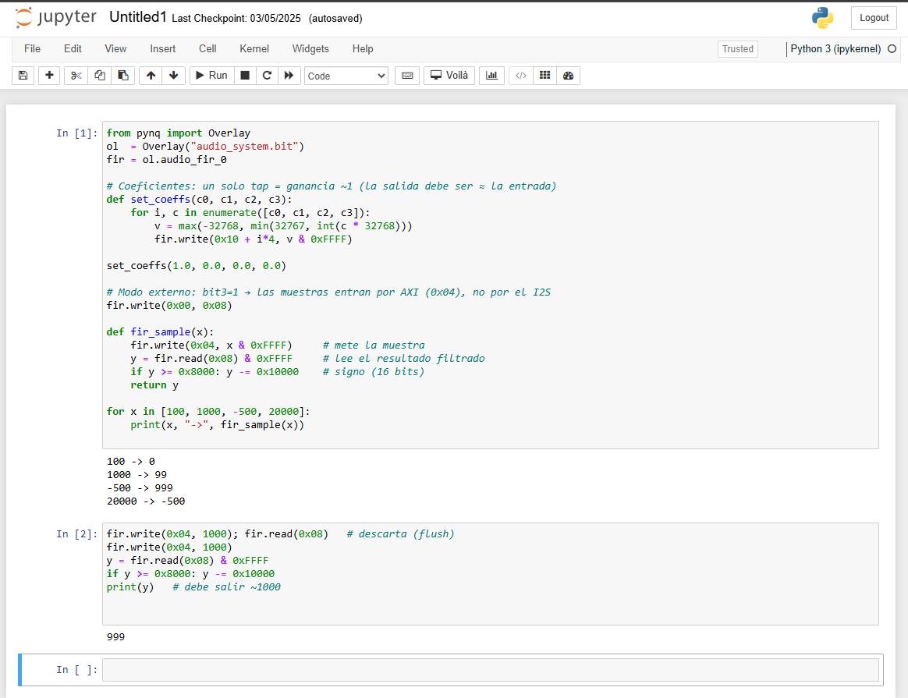

**The result.** The STM32 generates a clean sine with a high-frequency component
added at f_s/4 (the "noise"). The FPGA's FIR — a 4-tap moving average, which
nulls f_s/4 — removes it. Input (noisy) vs output (filtered), end to end:

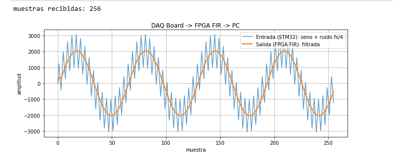

A signal **generated by my PCB**, **filtered by my FPGA**, shown on the PC — the
same acquire → process shape as a real radar / SDR / instrument front-end, built
end to end.

---

## Firmware

Bare-metal, **no HAL** — direct register access so every line is understood.

```
firmware/
├── src/
│   ├── startup.c      # vector table, reset handler, .data/.bss init
│   ├── main.c         # read sensors, drive DAC, stream over UART
│   ├── i2c.c/.h       # I²C1 driver (TMP117, ADS1115, MCP4725)
│   ├── spi.c/.h       # SPI1 driver (W25Q32)
│   └── uart.c/.h      # USART1 driver (→ CH340 → USB)
├── stm32f103c8.ld     # linker script (64 K flash, 20 K RAM)
├── Makefile           # build / flash / clean
├── build.ps1          # Windows build (no make required)
└── flash.ps1          # Windows flash via ST-Link
```

```bash
cd firmware
make            # or ./build.ps1   → build/daq.elf
make flash      # or ./flash.ps1   → program via ST-Link + OpenOCD
```

Toolchain: `arm-none-eabi-gcc` (xPack) + `openocd`. ST-Link connects to J3 (SWD).
See [docs/FIRMWARE_WALKTHROUGH.md](docs/FIRMWARE_WALKTHROUGH.md) and
[docs/DASHBOARD.md](docs/DASHBOARD.md) for a guided read of the code.

---

## Known limitations → Rev B (design analysis)

Kept as engineering notes rather than a rebuild:

- **🔴 ADC inputs not broken out.** AIN0–3 aren't routed to any header or test
  point, so external signals can't be connected without rework. For a DAQ board
  this is the #1 fix. (Found during bring-up — the ADC works, but its inputs
  float.)
- **D1 (PC13)** wired in source mode (dimmer); flip to sink in Rev B.
- VDDA unfiltered; NRST without cap; add "connect under reset" to SWD header.

---

## Roadmap

1. ~~**DAC function generator** (sine/triangle/square via HW timer)~~ ✅ done
2. ~~**Standalone datalogger** to the W25Q32, dumped over USB~~ ✅ done
3. ~~**Timer + DMA sampling** with interrupt-driven UART (kHz sample rates)~~ ✅ done
4. ~~**PYNQ-Z2 integration** — feed samples to an FPGA FIR filter (PCB → FPGA → PC)~~ ✅ done
5. **Flash-stored calibration** (offset/gain against a known reference)

---

## Author

Alex Morral — Telecommunications Electronics Engineering. Building a hardware
portfolio toward FPGA/RTL and hardware engineering roles.
