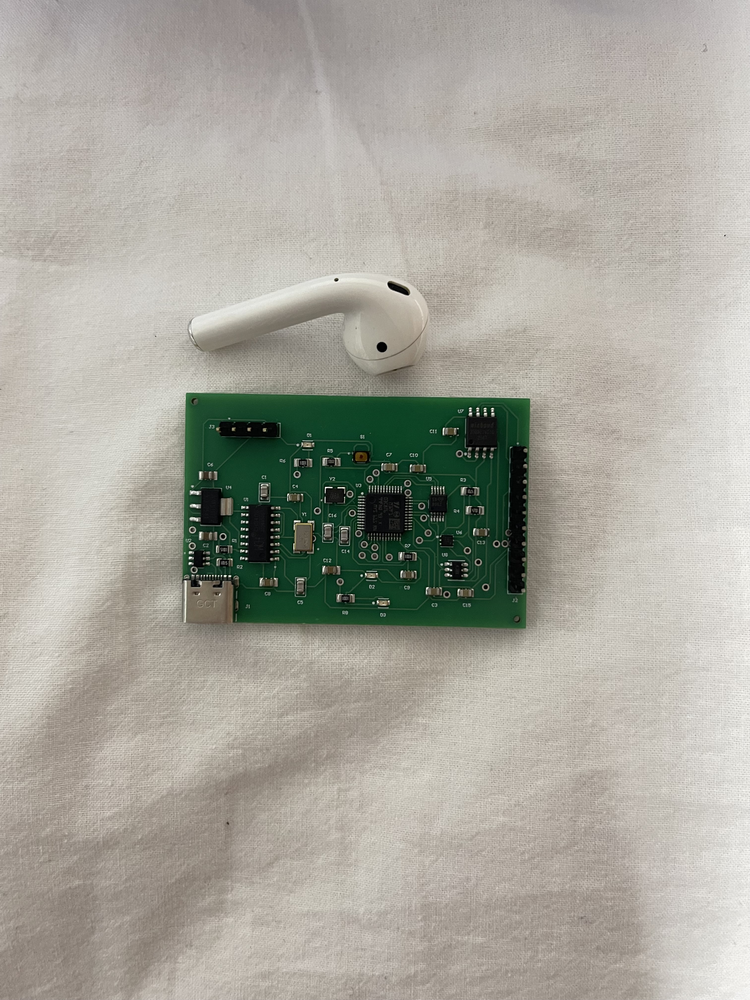

# DAQ Board — General-Purpose Data Acquisition Board

A 2-layer, USB-C powered **data acquisition board** built around an STM32F103,
designed from scratch in Altium, manufactured at JLCPCB, and brought up with
bare-metal firmware. It measures real-world analog signals (16-bit ADC),
generates analog output (12-bit DAC), reads temperature to ±0.1 °C, stores data
to SPI flash, and streams everything to a live browser dashboard over USB.

> Portfolio project #2 of 3 (FPGA → **PCB** → Embedded). Focus: full hardware
> flow — schematic → layout → fabrication → bring-up → firmware.



---

## What it demonstrates

- **Mixed-signal PCB design** in Altium: analog (ADC/DAC/LDO) + digital (MCU/flash)
- **Multiple buses**: I²C, SPI, UART, USB
- **Full manufacturing flow**: DRC → Gerbers → JLCPCB assembly → DFM
- **A pin-by-pin schematic audit before paying** that caught a real error (R5)
- **Bare-metal firmware** (no HAL): direct register access, custom linker script
  and startup, driver code for every peripheral
- **A live web instrument**: Node serial bridge + WebSocket + custom canvas UI

---

## Hardware

| Component | Ref | Function | Bus / Address |
|---|---|---|---|
| STM32F103C8T6 | U3 | MCU (Cortex-M3, 72 MHz) | — |
| ADS1115 | U5 | 16-bit ADC, 4 channels | I²C `0x48` |
| TMP117 | U6 | Precision temp sensor (±0.1 °C) | I²C `0x49` |
| MCP4725 | U8 | 12-bit DAC | I²C `0x60` |
| W25Q32 | U7 | 4 MB SPI flash | SPI |
| CH340G | U1 | USB↔UART bridge (3.3 V) | — |
| USBLC6-2SC6 | U2 | USB ESD protection | — |
| AMS1117-3.3 | U4 | 3.3 V LDO | — |
| USB-C | J1 | Power + data | — |

**Board:** 2-layer FR-4, 1.6 mm, HASL, 59.94 × 40.01 mm. Designed in Altium
Designer, assembled by JLCPCB.

---

## The schematic audit (the interesting part)

Before paying for assembly, the whole schematic was audited **pin by pin against
datasheets**, block by block. Result: a healthy design with **one real error**.

- **Power (AMS1117):** VIN/VOUT/GND correct, tab tied to VOUT (the classic 1117
  trap — here done right), 10 µF in/out.
- **STM32:** all VDD/VDDA→VCC, VSS→GND, BOOT0→GND, clock OK.
  **🔴 R5 was 100 Ω → should be 10 kΩ (NRST pull-up). Caught and corrected.**
- **USB:** UART cross correct (CH340 RXD→TX), CH340 at 3.3 V, USBLC6 with no
  D+/D− short, R1/R2 = 5.1 kΩ.
- **I²C:** addresses verified collision-free → `0x48` / `0x49` / `0x60`
  (MCP4725 is the **A0** variant → `0x60`, *not* `0x62`). Pull-ups 4.7 kΩ.
- **SPI flash:** `/HOLD` and `/WP` tied to VCC (critical for the W25Q32).
- **LEDs/SWD:** LED polarity correct; noted D1 (PC13) wired in source mode.

Routing note: the Situs auto-router reported "135/135 100%", but DRC revealed
**23 shorts + 30 clearance violations** → Unroute All + hand-routing to a clean DRC.

---

## Bring-up results

Every peripheral was validated step by step over SWD (ST-Link V2 + OpenOCD):

| Step | Result |
|---|---|
| Power (3.3 V rail) | ✅ measured |
| USB / CH340 enumerates | ✅ COM port |
| STM32 detected over SWD | ✅ Cortex-M3 |
| Blink LED (PB0) | ✅ validates MCU + crystal |
| TMP117 temperature (I²C) | ✅ ~29.6 °C stable |
| ADS1115 ADC read (I²C) | ✅ responds to PGA change |
| MCP4725 DAC output (I²C) | ✅ 1.64 V measured vs 1.65 V set |
| W25Q32 flash (SPI) | ✅ JEDEC `EF 40 16`, write/read PASS |

---

## Firmware

Bare-metal, **no HAL** — direct register access so every line is understood.

```
firmware/
├── src/
│   ├── startup.c      # vector table, reset handler, .data/.bss init
│   ├── main.c         # application: read sensors, drive DAC, stream over UART
│   ├── i2c.c/.h       # I²C1 driver (TMP117, ADS1115, MCP4725)
│   ├── spi.c/.h       # SPI1 driver (W25Q32)
│   └── uart.c/.h      # USART1 driver (→ CH340 → USB)
├── stm32f103c8.ld     # linker script (64 K flash, 20 K RAM)
├── Makefile           # build / flash / clean (needs make + arm-none-eabi-gcc)
├── build.ps1          # Windows build (no make required)
└── flash.ps1          # Windows flash via ST-Link
```

### Build & flash

```bash
# With make (Linux/macOS/MSYS):
cd firmware
make          # build → build/daq.elf
make flash    # program via ST-Link + OpenOCD

# On Windows without make:
./build.ps1
./flash.ps1
```

Toolchain: `arm-none-eabi-gcc` (xPack) + `openocd`. ST-Link connects to J3 (SWD).

---

## Live dashboard

A Node.js bridge reads the USB serial stream and pushes it to the browser over
WebSocket; the front-end renders a test-&-measurement style instrument
(4-channel scope view, live temperature, DAC control, min/max/avg stats, CSV export).


```bash
cd dashboard
npm install
npm start            # auto-detects the CH340 port, serves http://localhost:3000
```

---

## Known limitations → Rev B

- **🔴 ADC inputs not broken out.** AIN0–3 are not routed to any header or test
  point, so external signals can't be connected without rework. For a DAQ board
  this is the #1 fix. (Found during firmware bring-up — the ADC works, but its
  inputs float.)
- **D1 (PC13)** wired in source mode (dimmer); flip to sink in Rev B.
- LEDs at 1 kΩ are dimmer than planned (330 Ω intended).
- VDDA unfiltered; NRST without cap; add "connect under reset" to SWD header.

---

## Roadmap

1. **DAC function generator** (sine/triangle/square via HW timer)
2. **Standalone datalogger** to the W25Q32, dumped over USB
3. **Timer + DMA sampling** with interrupt-driven UART (kHz sample rates)
4. **PYNQ-Z2 integration** — feed samples to an FPGA FIR filter (ties the 3
   portfolio projects into one signal chain: PCB → FPGA → PC)
5. **Flash-stored calibration** (offset/gain against a known reference)

---

## Author

Alex Morral — Telecommunications Electronics Engineering. Building a hardware
portfolio toward FPGA/RTL and hardware engineering roles.
